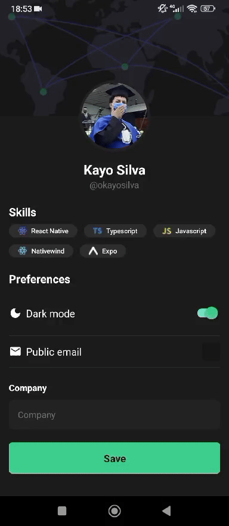

Status: Completo 🚀

## Native Skills
O Native Skills é um aplicativo que visa exibir as habilidades dos usuários, funcionando como um portfólio.

## Funcionalidades:
 * Home com as informações de skills do usuário
 * Dark Mode e Light Mode

<hr/>

## Tecnologias Utilizadas:

 * React-Native
 * NativeWind (TailwindCSS)
 * Nativecn (shadcn/ui)
 * Lucide React
 * prettier plugin tailwindcss
 * typescript
 * Expo
<hr/>

 ## Demonstração:
 
<div>
    
</div>

## Instalação
  * Faça um clone do repositório do projeto no GitHub.
  * Com o expo e React Native configurado, navegue até o diretório do projeto.
  * Execute o seguinte comando para instalar as dependências:

```
$ npm instal
```

## Running the project
```
$ npx expo start
```
